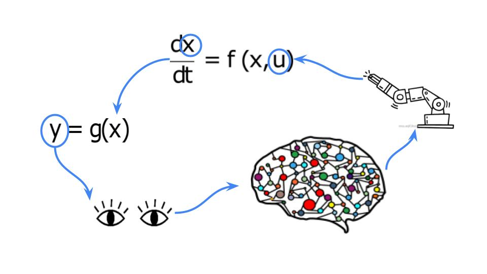

<p align="center">
  
</p>

# code_acme


[](https://github.com/francescocarpanese/code_acme/actions/workflows/ci.yaml)

**C**ontrol **O**rdinary **D**ifferential **E**quations using Deepmind [acme](https://github.com/deepmind/acme) framework. 

*   Implement simple environments with ode physics to investigate continous action space control with deep reinforcement learning. 
*   Provide implementation examples of custom environments with [dm-control](https://github.com/deepmind/dm_control) framework specifics.
*   Provide examples of using [acme](https://github.com/deepmind/acme) framework to train deep reinforcement learning agent for continuous action space control.

The implemented environments are meant to be lightwise to enable training with limited computational resources. 
However, thanks to [acme](https://github.com/deepmind/acme) framework, the experiments can be easily scaled up to allow for distributed learning.

Ideally the project would serve as a tutorial for students and researchers to interfacing their own custom environments with [acme](https://github.com/deepmind/acme) framework and exploiting deep reinforcement learning for continuous control purposes. 

# Installation
We recommend installation with docker container. 

Click the drop-down  below
<details>
<summary><b>docker container</b></summary>
<br>


- Build docker image.

```
make build 
```

- Run bash shell on docker image. 
  
No gpus
```
make bash
```

With GPU
```
make bash-gpu
```


The docker image includes all the package dependencies for training including `tensorflow`, `acme`,`dm_control`.
Running `make bash` will mount `code_acme` folder as a [docker volume](https://docs.docker.com/storage/bind-mounts/). 
This allows to develop your code within  or outside the docker container in your favourite environment.

- Install `code_acme`

From the docker container bash, install `code_acme` package to make sure you are using the latest version of the package including eventually your local modifications. 
```
pip install .
```

- Test installation.
```
pytest
```
</details>


<details>
<summary><b>virtualenv</b></summary>
<br>
Make sure your user has the writing rights. If not, run with `sudo`.  

Generate and activate virtual env.
```
pip install virtualenv
virtualenv .code-acme
source .code-acme/bin/activate
```
  
Install `code_acme` packages.
```
pip install .[dev]
```

Test installation.
```
pytest
```
</details>

If you are developing with `devcontainer` and `VScode`, `code_acme` contains `.json` files to set-up the environment.
  
# Available environments and tasks

[Here](environments/dm_control) you can find the developed environments. 

* [tank](environments/dm_control/tank): 
  Control water level in a tank with nozzle acting on inflow. 1D ode with, stable system, 1 continuous space action.  
* [moving_coil](environments/dm_control/moving_coil):
  Control position of a linear wire attracted by 2 wires fixed in space, acting on the static wire currents. 1D ode, unstable system, 2 competing continuous space actions. 

# Examples/tutorial

We provide a colab notebook with an introductive tutorial explaning how to implement a simple physical environment with [dm-control](https://github.com/deepmind/dm_control) framework, train an agent for continuous action space control with [acme](https://github.com/deepmind/acme) and evaluate the results with tensorboard. <a href="https://colab.research.google.com/github/francescocarpanese/code_acme/blob/main/tutorials/tank_control.ipynb" target="_parent"></a>

The script [examples/train.py](examples/train.py) provides examples on how to train [mpo](https://github.com/deepmind/acme/tree/master/acme/agents/tf/mpo), [d4pg](https://github.com/deepmind/acme/tree/master/acme/agents/tf/d4pg), [dmpo](https://github.com/deepmind/acme/tree/master/acme/agents/tf/dmpo) agents on the [developed environments](environments/dm_control). 
From a docker container bash or virtualenv with `code_acme` installed run, 
```
python examples/train.py --environment tank --agent mpo
```

Policy checkpoints are store in `~acme` path on a dedicate folder for each process. To evaluate and visualize the results of the last updated policy a simple script [examples/eval.py](examples/eval.py) is given.

# Future plans 
Below a high priority wishing list: 
- Examples of training agent with distributed learning using [launchpad](https://github.com/deepmind/launchpad), [#12](https://github.com/francescocarpanese/code_acme/issues/12)
- Flexibility in storing checkpoints and snapshots during training specifying the storing path following the solution in [mava](https://github.com/instadeepai/Mava), [#13](https://github.com/francescocarpanese/code_acme/issues/13)
- Utils for hyperparameters scan with [wandb](https://wandb.ai/site), [#14](https://github.com/francescocarpanese/code_acme/issues/14)
- Parameters handling with [hydra](https://hydra.cc/docs/intro/), [#16](https://github.com/francescocarpanese/code_acme/issues/16)
- Implement more complex tasks and compare DRL performances against linear control solutions.

# Contributing
If you have any question reach out at `francesco [dot] carpanese [at] hotmail [dot] it` or in the dicussion.
